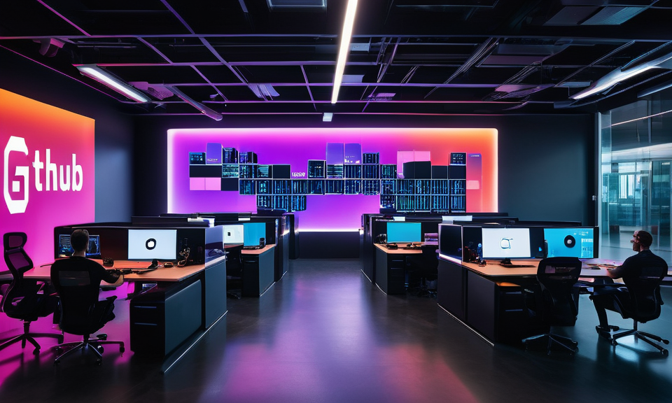

# Fachinformatiker:innen für Anwendungsentwicklung

- Wir sind ein agiles, internationales und multikulturelles [Team](https://github.com/orgs/wearesolutionarchitects/people) von Fachinformatiker:innen für Anwendungsentwicklung.

- Wir haben uns innerhalb einer Umschulungsmassnahme bei unterschiedlichen Bildungsträgern und in unterschieldichen Praktikas  kennengelernt und dabei das Potential der **Synergie-Effekte** erkannt!

- Dabei haben wir feststellen dürfen - wie wertvoll es ist, sich auch über unterschliedliche Bildungsträger, Praktikums-Betriebe und Ausbildungsjahrgänge hinweg auszutauschen zu können 🙏

Deshalb sind wir hier, um uns gegenseitig zu unterstützen 👍, voneinander zu lernen 📖 und **gemeinsam** an Projekten zu arbeiten.

---

## Unsere Mission

Aufbau einer Community von Fachinformatiker:innen für Anwendungsentwicklung, Developer, Solution Architects, Prompt Engineers, Data Scientists, Software Engineers und Projektmangern.

- Innerhalb der Community arbeiten wir **gemeinsam** an Projekten
- Durch die **individuellen Fähigkeiten und Erfahrungen** der Mitglieder können wir **voneinander lernen** und uns **gegenseitig unterstützen**.
- Wir sind davon überzeugt, dass wir nur durch **Zusammenarbeit und Wissensaustausch** bessere Lösungen entwickeln können!
- Wir möchten eine Umgebung schaffen, in der jeder die **Möglichkeit hat**, seine **Fähigkeiten zu verbessern** und neue Technologien zu erlernen!
- Wir sind davon überzeugt, dass wir durch den Austausch von Ideen und Erfahrungen nicht nur unsere eigenen Fähigkeiten verbessern, sondern auch die **gesamte Community** stärken können.
- Wir sind eine Community von Fachinformatiker:innen für Anwendungsentwicklung, die sich leidenschaftlich für Technologie und Softwareentwicklung einsetzen. Wir sind von der  **Kraft der Zusammenarbeit und des Wissensaustauschs** überzeugt!
- Mit dieser Kraft werden wir **innovative Lösungen entwickeln** und dabei unsere **Fähigkeiten kontinuierlich verbessern**!

---

## Wie kannst Du mitmachen?

Wenn Du Fachinformatikerin oder Fachinformatiker für Anwendungsentwicklung (oder einfach interessiert) bist und Dich unserer **Community** anschließen möchtest, dann bist Du herzlich willkommen 👍

Hier sind einige Möglichkeiten, wie Du mitmachen kannst:

- **Folge uns**: Klicke auf den "Follow" Button oben rechts, um über Neuigkeiten und Updates informiert zu werden.
- **Erstelle ein Issue**: Wenn Du ein Problem hast oder eine Frage stellen möchtest, dann erstelle ein Issue in dem Repository, für welches Du Dich intereessiert und wir werden unser Bestes tun, um dir zu helfen.
- **Mach mit bei Projekten**: Wir haben einige Projekte, an denen Du teilnehmen kannst. Schau dir die Projekte an und suche dir eines aus, an dem Du mitarbeiten möchtest.

---

## Unsere Projekte

Hier sind einige Projekte, an denen Wir arbeiten:

- [Ausbildung](https://github.com/wearesolutionarchitects/ausbildung-public) | Training, Dokumentation und Informationen zur Ausbildung
- [La Mediterranea](https://la-mediterranea.eu) | Online-Reservierungssystem für Bars & Restaurants | aktuell noch private

---

## Unsere Github-Stats

